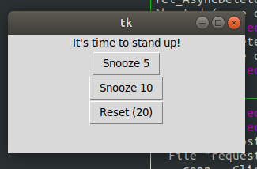

# standup_timer
A python script that pops up a tkinter window to remind you to stand up at some specified interval. It also will show you the remaining time in http://localhost:5001/

```python standup_timer.py 30```

or

```python standup_timer.py #defaults to 20```

<br/>
<br/>


